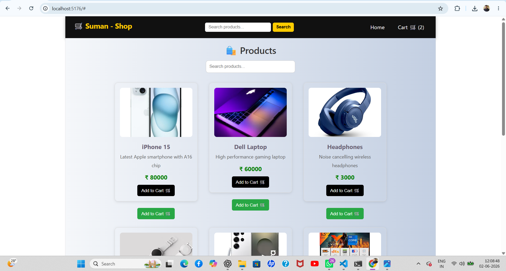

# 🛒 Ecommerce UI

A modern and responsive Ecommerce User Interface built using React.js and Vite.

## 🚀 Live Demo

https://ecommerce-ui-react-two.vercel.app/

## 📂 GitHub Repository

https://github.com/Suman1-panda/Ecommerce-UI-React

## 📸 Project Preview



## ✨ Features

- Responsive Design
- Product Listing
- Shopping Cart UI
- Reusable Components
- Modern User Interface
- Mobile Friendly Layout

## 🛠️ Tech Stack

- React.js
- JavaScript
- HTML5
- CSS3
- Vite
- Git & GitHub
- Vercel

## 🚀 Run Locally

```bash
git clone https://github.com/Suman1-panda/Ecommerce-UI-React.git
cd Ecommerce-UI-React
npm install
npm run dev
```

## 👨‍💻 Author

**Suman Panda**

GitHub: https://github.com/Suman1-panda
